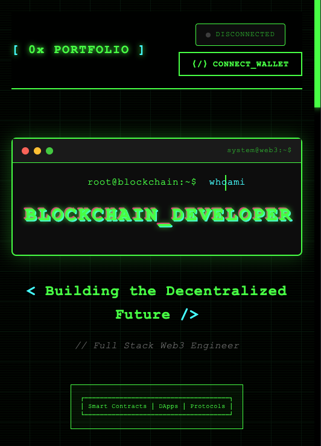
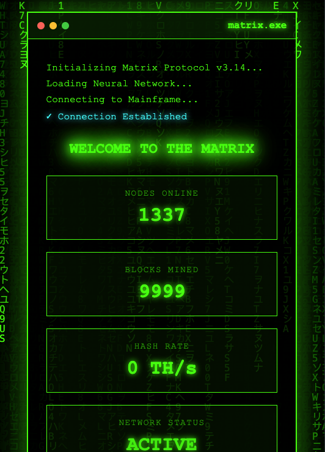
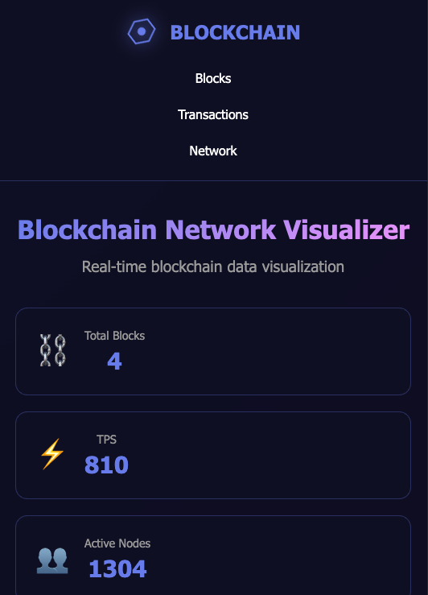

# Web3 Design Templates 🚀

A curated collection of Web3-style web templates featuring modern blockchain, cryptocurrency, and decentralized application interface designs.

## 📦 Template List

### 1. Terminal Theme - Command Line Style


**Features:**
- Terminal command-line interface design
- Typewriter animation effects
- Glitch visual effects
- Green tech-inspired color scheme
- Responsive layout

[View Details](template-1-terminal/) | [Live Demo](template-1-terminal/index.html)

---

### 2. Cyberpunk Theme - Neon Lights


**Features:**
- Cyberpunk neon light effects
- Dynamic number animations
- Random transaction generation
- Glowing button effects
- 3D grid background
- Scanning line animation

[View Details](template-2-cyberpunk/) | [Live Demo](template-2-cyberpunk/index.html)

---

### 3. Matrix Theme - Hacker Style


**Features:**
- Classic Matrix digital rain effect
- Canvas animation background
- Interactive terminal command line
- Executable command system
- Number counter animations
- Random system messages

[View Details](template-3-matrix/) | [Live Demo](template-3-matrix/index.html)

---

### 4. Blockchain Visualizer - Chain Visualization


**Features:**
- Blockchain visualization animations
- Real-time block generation
- Dynamic transaction list
- Network statistics dashboard
- Canvas chart animations
- Auto-mining functionality
- Modern gradient design

[View Details](template-4-blockchain/) | [Live Demo](template-4-blockchain/index.html)

---

## 🎨 Design Style

All templates incorporate Web3-related design elements:
- ⚡ Tech-inspired color schemes
- 🌟 Dynamic animation effects
- 💎 Modern interface design
- 🔐 Blockchain visual elements
- 📱 Fully responsive layouts

## 🚀 Quick Start

1. **Clone this repository**
```bash
git clone https://github.com/HEXAUX/web3-templates.git
cd web3-templates
```

2. **Choose a template**
```bash
cd template-1-terminal  # or any other template
```

3. **Open in browser**
Simply open `index.html` in your browser to view the template

## 📂 Project Structure

```
web3-templates/
├── template-1-terminal/
│   ├── index.html
│   ├── style.css
│   ├── preview.png
│   └── README.md
├── template-2-cyberpunk/
│   ├── index.html
│   ├── style.css
│   ├── script.js
│   ├── preview.png
│   └── README.md
├── template-3-matrix/
│   ├── index.html
│   ├── style.css
│   ├── script.js
│   ├── preview.png
│   └── README.md
├── template-4-blockchain/
│   ├── index.html
│   ├── style.css
│   ├── script.js
│   ├── preview.png
│   └── README.md
└── README.md
```

## 🛠️ Tech Stack

- **HTML5** - Semantic markup
- **CSS3** - Modern styling (Grid, Flexbox, Animations)
- **JavaScript** - Vanilla JS, no framework dependencies
- **Canvas API** - Dynamic graphics rendering

## 💡 Use Cases

These templates are perfect for:
- 🪙 Cryptocurrency project websites
- 🎮 NFT marketplace platforms
- ⛓️ Blockchain explorers
- 💼 DeFi application interfaces
- 🎨 Web3 personal portfolios
- 🚀 Decentralized applications (DApps)

## ✨ Customization

Each template provides easy-to-customize CSS variables:

```css
:root {
    --primary: #00ff00;
    --secondary: #0f0;
    --bg: #0a0a0a;
}
```

For detailed customization instructions, please refer to each template's README file.

## 📱 Responsive Design

All templates are optimized and fully support:
- 💻 Desktop computers
- 📱 Mobile devices
- 📲 Tablets

## 🤝 Contributing

Contributions are welcome! Feel free to submit new templates or improve existing ones.

1. Fork this repository
2. Create your feature branch (`git checkout -b feature/AmazingTemplate`)
3. Commit your changes (`git commit -m 'Add some AmazingTemplate'`)
4. Push to the branch (`git push origin feature/AmazingTemplate`)
5. Open a Pull Request

## 📄 License

MIT License - Free to use, please retain original author information

## 🌟 Star History

If this project helps you, please give it a Star ⭐️

## 📞 Contact

Questions or suggestions? Feel free to open an Issue!

---

**Made with ❤️ for the Web3 Community**
