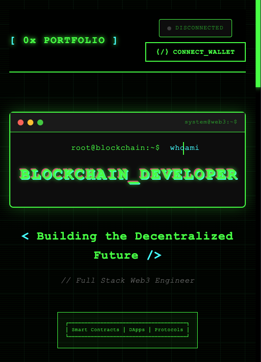

# Terminal Theme - Web3 Template

## Preview


## Features
- Terminal command-line style design
- Typewriter animation effect
- Glitch visual effects
- Dark tech-inspired color scheme
- Responsive design

## Usage
Simply open `index.html` in your browser to view the template

## Tech Stack
- HTML5
- CSS3 (Animations, Grid, Flexbox)
- Vanilla JavaScript

## Customization
You can modify CSS variables to adjust the color scheme:
```css
--primary: #00ff00;
--secondary: #0f0;
--bg: #0a0a0a;
```
