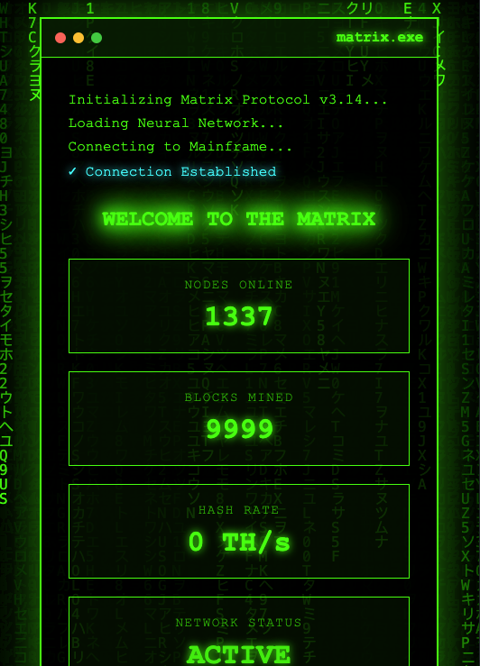

# Matrix Theme - Web3 Template

## Preview


## Features
- Classic Matrix digital rain background
- Interactive terminal command line
- Number counter animation
- Executable command system
- Hacker-style interface
- Random system message notifications
- Canvas animation effects

## Usage
Simply open `index.html` in your browser to view the template

## Available Commands
Enter in the command input box:
- `help` - Display available commands
- `status` - Show system status
- `hack` - Execute hacking sequence animation
- `clear` - Clear terminal output
- `disconnect` - Disconnect from system

## Tech Stack
- HTML5 Canvas
- CSS3 Animations
- JavaScript (Canvas API, Dynamic text effects)

## Customization
Modify character sets in script.js:
```javascript
const katakana = 'アイウエオカキクケコ...';
const latin = 'ABCDEFGHIJKLMNOPQRSTUVWXYZ';
```

Adjust digital rain speed and opacity as needed.
