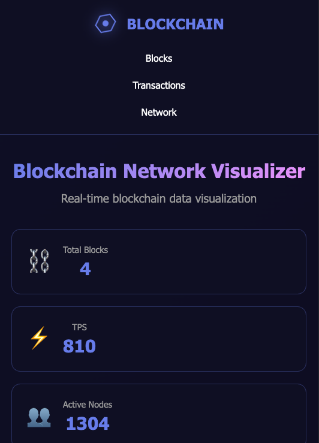

# Blockchain Visualizer - Web3 Template

## Preview


## Features
- Blockchain visualization animation
- Real-time block generation
- Dynamic transaction list
- Network statistics dashboard
- Canvas chart animations
- Auto-mining functionality
- Blockchain connection display
- Modern gradient design

## Usage
Simply open `index.html` in your browser to view the template

## Functionality
- Click "Mine New Block" to manually generate new blocks
- Auto-generate blocks (randomly every 5 seconds)
- Auto-generate transaction records
- Real-time network activity chart
- View latest block details

## Tech Stack
- HTML5
- CSS3 (Grid, Flexbox, Gradients)
- JavaScript (Canvas API, Dynamic data)
- Blockchain concept visualization

## Color Customization
Modify CSS variables:
```css
--primary: #667eea;
--secondary: #764ba2;
--accent: #f093fb;
--success: #4ade80;
```

## Blockchain Concepts
Demonstrates basic blockchain structure:
- Block number
- Block hash
- Previous block hash
- Timestamp
- Transaction count
